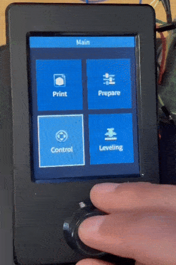

<!-- markdownlint-disable-next-line MD041 -->
[](https://github.com/Atomique13/ender3-v3-se-klipper-with-display/actions/workflows/build-firmware.yaml)

# Modified Klipper for the Creality Ender 3 V3 SE with display support

This is a modified [Klipper](https://www.klipper3d.org/) that supports the original **Creality E3V3SE (Ender 3 V3 SE)** display by combining [E4ST2W3ST serial bridge](https://github.com/Klipper3d/klipper/commit/6469418d73be6743a7130b50fdb5a57d311435ca) with the [ender 3 v3 se display interface](https://github.com/jpcurti/E3V3SE_display_klipper) to make it possible to use the printers display cable without any hardware modification. This repository is forked from [0XD34Ds klipper config](https://github.com/0xD34D/klipper_ender3_v3_se), but its commits can be applied separately from any other configuration.


## Installation

### Using pre-built binaries

Copy the `.bin` file from a [release](https://github.com/jpcurti/ender3-v3-se-klipper-with-display/releases) to a SD card and flash it into your printer as you would do when installing klipper. **Note: remember to rename the file to a different filename as the last flashed binary, otherwise the printer won't recognize it as a new file and won't update.**

### By cloning the project and building it from source

Clone the project, navigate to the repository directory and configure your build with `make menuconfig`:

```sh
git clone https://github.com/jpcurti/ender3-v3-se-klipper-with-display
cd ender3-v3-se-klipper-with-display
make menuconfig
```

In the configuration menu, enable the serial bridge for **USART2** and the klipper parameters for the Ender 3 v3 se:


After that, build your own binaries with `make`, copy the `klipper.bin` from the output folder to a SD card and flash as you would do with klipper.

## Configuration

A section called `[e3v3se_display]` need to be added to your `printer.cfg` to enable the display. Besides that, you can set a custom language and logging (defaulted as english and false, respectively), like:

```yaml
[e3v3se_display]
language: portuguese
logging: True
```

### Custom macros

The new 'Misc' menu list a set of custom macros that can be defined on your `printer.cfg`.
You can use this to call macros defined on Klipper using your screen directly, e.g.: Load/Unload filament, calibrate Z offset, calibrate bed mesh, clean nozzle, etc.

On your `printer.cfg` you can define the macros using a new config section `[e3v3se_display MACRO%I]` where `%i` is the macro number (This should be unique per macro). The following properties are available:

| Property | Data type | Required | Description                                                      |
|----------|-----------|----------|------------------------------------------------------------------|
| label    | Text      | Yes      | Text to be displayed on the screen                               |
| icon     | Integer   | No       | Internal firmware icon. Defaults to 14 (file icon)               |
| gcode    | Text      | Yes      | GCODE to be run when the item is selected.  i.e `G28` for homing |

Some examples for your inspiration:

```yaml
[e3v3se_display MACRO1]
gcode: LOAD_FILAMENT
label: Load filament
icon: 14

[e3v3se_display MACRO2]
gcode: UNLOAD_FILAMENT
label: Unload filament
icon: 14

[e3v3se_display MACRO3]
gcode: CALIBRATE_Z_OFFSET
label: Calibrate Z offset
icon: 12

[e3v3se_display MACRO4]
gcode: CALIBRATE_BED_MESH
label: Calibrate bed mesh
icon: 29

[e3v3se_display MACRO5]
gcode: CLEAN_NOZZLE
label: Clean nozzle
icon: 9
```

To browse icon library, call the macro `ENDER_SE_DISPLAY_ICON_FINDER` on your Klipper console and use the screen to navigate through the icons.

## Supported features

The currently supported features are:

| Feature                | Status  |
| ---------------------- | ------- |
| Print file             | &check; |
| Tune print             | &check; |
| Pause/continue print   | &check; |
| Stop print             | &check; |
| Move Axis              | &check; |
| Home Axis              | &check; |
| Set Z offset           | &check; |
| Disable step motors    | &check; |
| Preheat bed            | &check; |
| Cooldown               | &check; |
| Set nozzle temperature | &check; |
| Set bed temperature    | &check; |
| Set max speed          | &cross; |
| Set max acceleration   | &cross; |
| Set steps per-mm       | &cross; |
| Manual probe popup     | &check; |
| Custom macros menu     | &check; |

Features that are not available are shown as a pop-up:



## Important

- This project is based on the **E3V3SE display firmware 1.0.6**. Any changes in the firmware version, such as a new version from Creality, can change the assets locations within the display memory and a new mapping would be necessary. A list of available firmware can be found [on Creality website](https://www.creality.com/pages/download-ender-3-v3-se) and a detailed instruction on how to update your display is available on [youtube](https://www.youtube.com/watch?v=8oRuCusCyUM&ab_channel=CrealityAfter-sale).

## Related projects and credits

- This repository is heavily based on the [DWIN_T5UIC1_LCD](https://github.com/odwdinc/DWIN_T5UIC1_LCD) repository for the E3V2 display and makes use of most of the available classes and methods implemented there, with the necessary modifications for the E3V3SE display. All credits goes to the [author of the DWIN_T5UIC1_LCD project](https://github.com/odwdinc) for making the version which this repository is based on.

- This repository includes a proposed change proposed by [E4ST2W3ST](https://github.com/Klipper3d/klipper/commit/6469418d73be6743a7130b50fdb5a57d311435ca) to enable the MCU to act as a serial bridge between USB and the display serial port. Without his work, this project wouldn't exist.

- This repository is forked and makes use of an already configuration for the ender 3 v3 se made by [0XD34D](https://github.com/0xD34D/klipper_ender3_v3_se), where a lot of different improvements were made.

## FAQ

### Printer is not flashing the .bin from the releases or built from source

Please check if you are renaming the binaries between flashes as mentioned in the section [Using pre-built binaries](#using-pre-built-binaries)

<!-- markdownlint-disable-next-line MD026 -->
### After installing this project my display went crazy!

Check if you installed the **E3V3SE display firmware 1.0.6** as mentioned in section [Important](#important)

### I found a bug in the GUI or something doesn't work as expected

Please [open an issue for bugs/feature requests](https://github.com/jpcurti/ender3-v3-se-klipper-with-display/issues) and make a question in the project [discussion](https://github.com/jpcurti/ender3-v3-se-klipper-with-display/discussions)

## Other useful links

- [Klipper documentation](https://www.klipper3d.org)
- [Octoprint](https://octoprint.org/)
- [Moonraker - Web API Server for Klipper](https://github.com/arksine/moonraker)
- [DWIN_T5UIC1_LCD - Python class for the Ender 3 V2 LCD](https://github.com/odwdinc/DWIN_T5UIC1_LCD)
- [jpcurti's Python based interface for the Creality Ender 3 V3 SE display running Klipper](https://github.com/jpcurti/E3V3SE_display_klipper)
- [0xD34D's Ender3 V3 SE Klipper config](https://github.com/0xD34D/klipper_ender3_v3_se)
